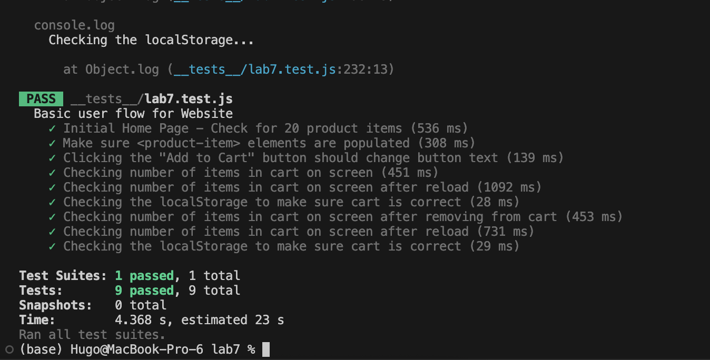

# Lab 7

### 1
> Where would you fit your automated tests in your Recipe project development pipeline? Select one of the following and explain why.

`Within a Github action that runs whenever code is pushed`. I think this option makes the most sense because it's automated (so that you don't have to add a bunch of extra things to do every time you make new code). Furthermore, it happens incrementally if you follow good development practices (i.e. continuously pushing updates), so if a bug exists you'll likely catch it quickly. Since GitHub works with a change history, it's possible to revert any push that doesn't pass the test, so there's no need to test all code locally before pushing because that might take a long time if you have a lot of tests.

### 2
> Would you use an end to end test to check if a function is returning the correct output?

`No` (we would use unit testing for that)

### Screenshot for Puppeteer

### 3
> What is the difference between navigation and snapshot mode?

Navigation mode analyzes the webpage at the moment of loading it, while snapshot mode analyzes the webpage at the moment you activate Lighthouse. This means that navigation mode reloads the entire webpage so that it can analyze it at startup, which can be helpful to analyze load times, while snapshot mode lets you have a bit more control of what Lighthouse analyzes after user interactions.

### 4
> Name three things we could do to improve the CSE 110 shop site based on the Lighthouse results.

1. You could reduce the sizes of images sent to the user to the size they'll actually be displayed as. According to Lighthouse, this could save up to 518 KiB out of 910 total KiB image data sent to the user, which is a more than 50% reduction.
2. According to Lighthouse, you should put `<meta name='viewport'>` with width or initial-scale in your header to optimize for mobile screen sizes. Apparently, it also removes a 300 millisecond delay to user input on mobile, which has something to do with double tapping.
3. You could add a caching policy for repeat users on the webpage. This would mean returning users could load the webpage faster. Lighthouse gives a list of 25 resources that could be cached, totaling to about 1000 KiB worth of data cached.